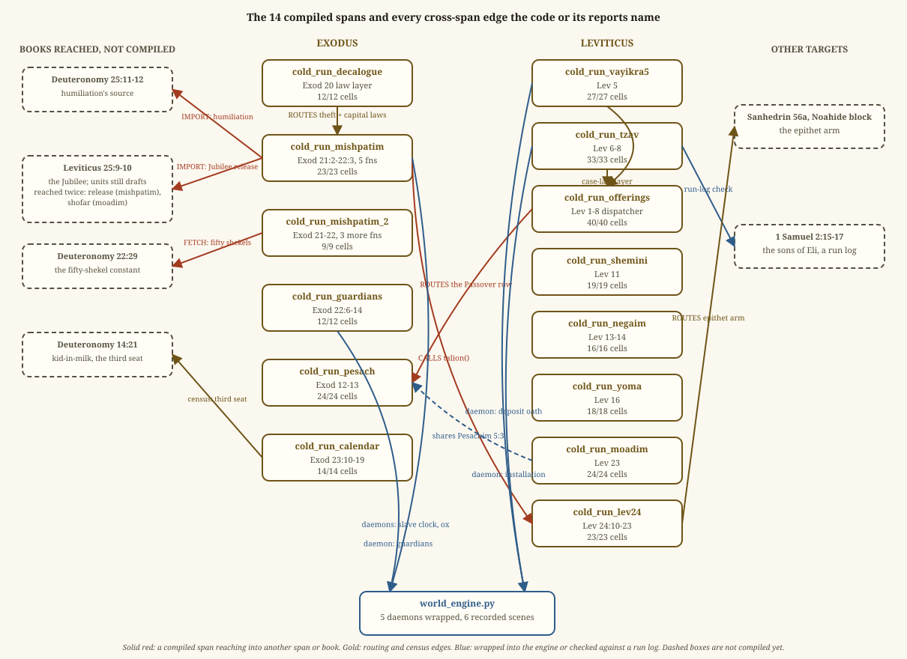

# DEPENDENCIES — every edge between the compiled spans and the books they reach

The dependency graph of the compiled code, as the program's own gate
draws it. Written 2026-09-05 by hand from the fourteen spans of that
day; rewritten 2026-09-13 from the gate's index at the close of the
book of Numbers. An edge is listed only where the text or the code
names it: a verse in one span naming an offering type or an
institution whose home is another span (the type census), an explicit
pointer form in the ink ("as prescribed," "as the LORD commanded," "one
law," the comparative on an offering noun), or a live Python import
verified against the source. Every edge carries two answers. Its LABEL
under the link review law — a REFERENCE the text makes itself, a
TRANSFER that names its teacher, a HYPOTHESIS no teacher taught, or
NONE, a connection that carries no rule (a homograph, a test
registering another's rules). And its DISPOSITION, how it is wired — a
live CALL, a path VIA another runner, a PARAMETER carried rather than a
procedure, a call OWED with its debt named, a REVERSE (the home already
calls this runner, so a call back would cycle), or FALSE, a homograph
refused. The gate `World/step9/dependency_census.py` runs before every
cold sweep and refuses an edge without both; its index is
`World/step9/DEPENDENCY_INDEX.md`, regenerated on every run, and the
dispositions live in `dependency_dispositions.yaml`. THE_LINKS.md in
this folder teaches the kinds from thirteen worked examples.

*The picture above dates from 2026-09-05 and shows the fourteen spans
of that day. The fourth book's eighteen runners, with their spans,
scores and live calls, are drawn in `diagrams/08_numbers_runners.svg`
(2026-09-13); the whole graph of fifty-seven is the runners' table
below.*

## The census, 2026-09-13

- 57 runners over 4,878 verses; 42 type tokens, 5 pointer forms.
- 482 edges: 292 references, 48 transfers with teachers, 9
  hypotheses, 133 of none. By wiring: 338 live calls, 32 reverse, 20
  via another runner, 8 parameters, 6 owed, 78 homographs refused.
- 173 pointers in the ink: 145 "as when" (the doing citing its
  command), 16 "as prescribed," 8 comparatives on an offering noun, 4
  "one law." 41 of them are run citations — the text's receipt for an
  order, closing a debit on the ledger; 101 point inside their own
  span; 19 call another runner; 2 carry a parameter; 10 are none.
- The fourth book's share: 178 edges (151 references, one transfer,
  26 homographs refused, no hypothesis) and 45 pointers (16 run
  citations, 29 internal).

## The runners

One row per compiled file, in the order of the scroll. "Calls out"
and "called by" are the live imports the gate verified; the five
counts are the edges the type census demanded of this runner and how
each was wired; "pointers" are the explicit cross-reference forms
found in its verses. The sequence runner is the tape itself: it calls
every other runner's daemon and is called by none.

| Runner | Span | Calls out (live) | Called by (live) | Edges: call / via / parameter / owed / false | Pointers |
|---|---|---|---|---|---|
| `mamre` | Gen 18:1-33; Gen 19:1-38; Gen 20:1-18; Gen 22:1-24; Gen 25:1-34; Gen 26:1-35; Gen 27:1-46; Gen 28:1-22; Gen 29:1-35; Gen 30:1-43; Gen 31:1-54 | family, guardians, offerings, pre_sinai, temurah | balak, sequence | 3 / 0 / 0 / 0 / 7 | 12 |
| `pre_sinai` | Gen 1:1-31; Gen 2:1-3; Gen 2:16-17; Gen 2:24-24; Gen 9:1-17; Gen 17:1-27 | calendar, clocks, decalogue, erection, holiness, holiness_b, incense_shekel, mishpatim, moadim, offerings, ordinances, pesach, priesthood, sanctions, tochacha, tzav, yoma, yovel | exodus_story, joseph, mamre, primeval, sequence | 3 / 0 / 0 / 0 / 0 | 1 |
| `family` | Gen 23:1-20; Gen 24:1-67; Gen 32:25-33; Gen 38:1-30; Gen 48:1-22; Gen 49:1-33 | clocks, guardians, holiness, holiness_b, incense_shekel, mishpatim, mishpatim_2, ordinances, pesach, priesthood, sanctions, sanctuary_build, yovel | balak, exodus_story, joseph, mamre, primeval, sequence, zelophehad | 7 / 0 / 0 / 0 / 8 | 4 |
| `primeval` | Gen 2:4-15; Gen 2:18-23; Gen 2:25-25; Gen 3:1-24; Gen 4:1-26; Gen 5:1-32; Gen 6:1-22; Gen 7:1-24; Gen 8:1-22; Gen 9:18-29; Gen 10:1-32; Gen 11:1-32; Gen 12:1-20; Gen 13:1-18; Gen 14:1-24; Gen 15:1-21; Gen 16:1-16 | family, minchah, offerings, pre_sinai, priesthood, sanctions, shemini, temurah | balak, refuge, sequence | 6 / 1 / 0 / 0 / 2 | 5 |
| `joseph` | Gen 32:1-33; Gen 33:1-20; Gen 34:1-31; Gen 35:1-29; Gen 36:1-43; Gen 37:1-36; Gen 39:1-23; Gen 40:1-23; Gen 41:1-57; Gen 42:1-38; Gen 43:1-34; Gen 44:1-34; Gen 45:1-28; Gen 46:1-34; Gen 47:1-31; Gen 50:1-26 | family, mishpatim_2, mishpatim_3, offerings, pre_sinai, vestments | second_census, sequence | 3 / 0 / 0 / 0 / 7 | 18 |
| `pesach` | Exod 12:1-51; Exod 13:1-16 | none | bamidbar, beha, calendar, erection, exodus_story, family, journeys, korach, moadim, offerings, ordinances, pesach_sheni, pre_sinai, sequence, temurah | 0 / 0 / 0 / 0 / 4 | 6 |
| `exodus_story` | Exod 1:1-22; Exod 2:1-25; Exod 3:1-22; Exod 4:1-31; Exod 5:1-23; Exod 6:1-30; Exod 7:1-29; Exod 8:1-28; Exod 9:1-35; Exod 10:1-29; Exod 11:1-10; Exod 12:29-42; Exod 12:50-51; Exod 13:17-22; Exod 14:1-31; Exod 15:1-27; Exod 16:1-36; Exod 17:1-16; Exod 18:1-27; Exod 19:1-25 | family, offerings, pesach, pre_sinai | balak, journeys, sequence | 4 / 0 / 1 / 0 / 5 | 20 |
| `decalogue` | Exod 20:1-17 | none | incense_shekel, ordinances, pre_sinai, sequence | 0 / 0 / 0 / 0 / 0 | 0 |
| `ordinances` | Exod 20:19-26; Exod 22:17-30; Exod 23:1-9; Exod 23:20-33 | decalogue, holiness, holiness_b, offerings, pesach, sanctions, yovel | erection, family, pre_sinai, priesthood, sanctuary_build, sequence, vestments | 3 / 0 / 0 / 0 / 2 | 0 |
| `mishpatim` | Exod 21:1-37; Exod 22:1-16 | lev24 | family, incense_shekel, pre_sinai, refuge, sequence | 1 / 0 / 1 / 0 / 0 | 3 |
| `mishpatim_2` | Exod 21:22-22; Exod 21:26-27; Exod 22:15-16 | none | family, joseph, sequence | 0 / 0 / 1 / 0 / 1 | 1 |
| `mishpatim_3` | Exod 21:7-11; Exod 21:13-15; Exod 21:17-17; Exod 21:20-21; Exod 22:1-2 | sanctions | joseph, refuge, sequence | 0 / 0 / 0 / 0 / 1 | 1 |
| `guardians` | Exod 22:6-14 | none | family, incense_shekel, mamre | 0 / 0 / 0 / 0 / 0 | 0 |
| `calendar` | Exod 23:10-19 | pesach, yovel | erection, incense_shekel, moadim, pre_sinai, sequence | 3 / 0 / 0 / 0 / 0 | 1 |
| `erection` | Exod 24:1-18; Exod 31:1-11; Exod 31:18-18; Exod 32:1-35; Exod 33:1-23; Exod 34:1-35; Exod 35:4-29; Exod 40:1-38 | calendar, incense_shekel, moadim, offerings, ordinances, pesach, priesthood, sanctuary_build, shemini_day, tzav, vestments | balak, journeys, pre_sinai, sequence | 12 / 1 / 0 / 0 / 7 | 11 |
| `sanctuary_build` | Exod 25:1-40; Exod 26:1-37; Exod 27:1-21; Exod 35:30-35; Exod 36:1-38; Exod 37:1-29; Exod 38:1-31 | chatat, offerings, ordinances, priesthood, tzav | bamidbar, beha, erection, family, incense_shekel, sequence, vestments | 2 / 0 / 0 / 0 / 1 | 2 |
| `vestments` | Exod 28:1-43; Exod 39:1-43 | ordinances, priesthood, sanctuary_build, yoma | chukat, erection, incense_shekel, joseph, sequence | 0 / 0 / 0 / 0 / 0 | 8 |
| `incense_shekel` | Exod 29:1-46; Exod 30:1-38; Exod 31:12-17; Exod 35:1-3 | calendar, chatat, decalogue, guardians, metzora, minchah, mishpatim, moadim, offerings, priesthood, sanctuary_build, tzav, vayikra5, vestments, yoma, yovel | bamidbar, erection, family, korach, mekoshesh, midian, musafim, naso, pre_sinai, sequence | 4 / 0 / 0 / 0 / 1 | 1 |
| `shemini` | Lev 11:1-47 | none | midian, primeval, sanctions, sequence | 0 / 0 / 0 / 0 / 0 | 0 |
| `clocks` | Lev 12:1-8; Lev 15:1-33 | chatat, minchah, offerings, vayikra5 | chukat, family, naso, pre_sinai, priesthood, sanctions, sequence | 3 / 0 / 0 / 0 / 0 | 0 |
| `negaim` | Lev 13:1-59; Lev 14:33-57 | none | beha, naso, sequence | 0 / 0 / 1 / 0 / 2 | 0 |
| `metzora` | Lev 14:1-32 | chatat, minchah, offerings, tzav, vayikra5 | chukat, incense_shekel, naso, sequence | 4 / 0 / 1 / 0 / 0 | 1 |
| `yoma` | Lev 16:1-34 | chatat, moadim, offerings | chukat, incense_shekel, musafim, pre_sinai, sequence, vestments | 2 / 0 / 0 / 0 / 1 | 2 |
| `sanctions` | Lev 17:1-16; Lev 18:1-30; Lev 20:1-27 | chatat, clocks, offerings, shemini | chukat, family, holiness_b, mishpatim_3, ordinances, pre_sinai, priesthood, primeval, refuge, sequence, zelophehad | 2 / 0 / 0 / 0 / 1 | 1 |
| `holiness` | Lev 19:1-18 | tzav, vayikra5, yovel | family, holiness_b, journeys, ordinances, pre_sinai, sequence | 0 / 1 / 0 / 0 / 0 | 0 |
| `holiness_b` | Lev 19:19-37 | holiness, sanctions, tzav, vayikra5 | family, korach, ordinances, pre_sinai, priesthood, sequence | 3 / 0 / 0 / 0 / 1 | 0 |
| `offerings` | Lev 1:1-13; Lev 3:1-17 | pesach | balak, chatat, clocks, erection, exodus_story, incense_shekel, joseph, korach, mamre, metzora, minchah, moadim, musafim, naso, ordinances, pre_sinai, priesthood, primeval, sanctions, sanctuary_build, sequence, shelach, shemini_day, tzav, yoma | 0 / 0 / 0 / 0 / 0 | 0 |
| `minchah` | Lev 1:14-17; Lev 2:1-16 | offerings, vayikra5 | chatat, clocks, incense_shekel, korach, metzora, moadim, musafim, naso, priesthood, primeval, sequence, shelach, shemini_day, tzav, vayikra5 | 1 / 0 / 0 / 0 / 0 | 0 |
| `priesthood` | Lev 21:1-24; Lev 22:1-33; Lev 24:1-9 | clocks, holiness_b, minchah, offerings, ordinances, sanctions, vayikra5 | balak, chukat, erection, family, incense_shekel, korach, naso, pre_sinai, primeval, refuge, sanctuary_build, sequence, vestments, vows | 4 / 0 / 0 / 0 / 3 | 0 |
| `moadim` | Lev 23:1-44 | calendar, minchah, offerings, pesach | beha, erection, incense_shekel, korach, musafim, pre_sinai, sequence, vows, yoma | 4 / 1 / 0 / 0 / 1 | 0 |
| `lev24` | Lev 24:10-23 | none | mishpatim, refuge, sequence | 0 / 0 / 0 / 0 / 1 | 3 |
| `yovel` | Lev 25:1-55; Lev 27:1-8; Lev 27:16-25 | tochacha | calendar, family, holiness, incense_shekel, korach, ordinances, pre_sinai, sequence, temurah | 0 / 0 / 0 / 0 / 0 | 0 |
| `tochacha` | Lev 26:1-46 | none | pre_sinai, sequence, yovel | 0 / 0 / 0 / 0 / 3 | 1 |
| `temurah` | Lev 27:9-15; Lev 27:26-34 | pesach, yovel | chukat, korach, mamre, primeval, sequence | 2 / 0 / 0 / 0 / 1 | 1 |
| `chatat` | Lev 4:1-35; Lev 10:8-20 | minchah, offerings, tzav, vayikra5 | chukat, clocks, incense_shekel, korach, metzora, sanctions, sanctuary_build, sequence, shelach, shemini_day, vayikra5, yoma | 10 / 0 / 0 / 0 / 1 | 8 |
| `vayikra5` | Lev 5:1-26 | chatat, minchah, tzav | chatat, chukat, clocks, holiness, holiness_b, incense_shekel, korach, metzora, minchah, naso, priesthood, sequence, vows | 5 / 1 / 1 / 0 / 0 | 2 |
| `tzav` | Lev 6:1-23; Lev 7:1-38; Lev 8:1-36 | minchah, offerings | chatat, erection, holiness, holiness_b, incense_shekel, korach, metzora, naso, pre_sinai, sanctuary_build, sequence, shemini_day, vayikra5 | 2 / 0 / 0 / 0 / 1 | 12 |
| `shemini_day` | Lev 9:1-24 | chatat, minchah, offerings, tzav | erection, second_census, sequence | 5 / 0 / 0 / 0 / 0 | 4 |
| `shelach` | Num 13:1-33; Num 14:1-45; Num 15:1-31 | bamidbar, chatat, korach, minchah, offerings | balak, borders, gad_reuben, journeys, musafim, refuge, second_census, sequence | 3 / 0 / 0 / 0 / 4 | 6 |
| `mekoshesh` | Num 15:32-36 | incense_shekel | balak, sequence | 0 / 1 / 0 / 0 / 0 | 1 |
| `korach` | Num 16:1-35; Num 17:1-28; Num 18:1-32 | bamidbar, chatat, holiness_b, incense_shekel, minchah, moadim, naso, offerings, pesach, priesthood, temurah, tzav, vayikra5, yovel, zelophehad | balak, borders, second_census, sequence, shelach | 9 / 1 / 0 / 0 / 0 | 3 |
| `chukat` | Num 19:1-22; Num 20:1-29; Num 21:1-35 | chatat, clocks, metzora, priesthood, sanctions, temurah, vayikra5, vestments, yoma | balak, beha, borders, gad_reuben, journeys, midian, naso, refuge, second_census, sequence | 3 / 0 / 0 / 0 / 3 | 3 |
| `bamidbar` | Num 1:1-54; Num 2:1-34; Num 3:1-51; Num 4:1-20 | incense_shekel, pesach, sanctuary_build | balak, beha, borders, gad_reuben, korach, midian, naso, refuge, second_census, sequence, shelach | 2 / 0 / 0 / 1 / 2 | 6 |
| `balak` | Num 22:1-41; Num 23:1-30; Num 24:1-25; Num 25:1-19 | bamidbar, chukat, erection, exodus_story, family, korach, mamre, mekoshesh, offerings, priesthood, primeval, shelach | journeys, midian, second_census, sequence | 1 / 0 / 0 / 0 / 2 | 3 |
| `second_census` | Num 25:19-19; Num 26:1-65 | balak, bamidbar, chukat, joseph, korach, shelach, shemini_day, zelophehad | borders, gad_reuben, journeys, refuge, sequence | 0 / 1 / 0 / 0 / 3 | 1 |
| `zelophehad` | Num 27:1-11; Num 36:1-12 | family, sanctions | borders, korach, refuge, second_census, sequence | 2 / 1 / 0 / 0 / 0 | 2 |
| `musafim` | Num 28:1-31; Num 29:1-39 | incense_shekel, minchah, moadim, offerings, shelach, yoma | sequence, vows | 3 / 3 / 0 / 0 / 0 | 9 |
| `vows` | Num 30:1-17 | moadim, musafim, naso, priesthood, vayikra5 | gad_reuben, sequence | 1 / 1 / 0 / 0 / 0 | 0 |
| `midian` | Num 31:1-54 | balak, bamidbar, beha, chukat, incense_shekel, shemini | sequence | 1 / 0 / 0 / 0 / 2 | 4 |
| `gad_reuben` | Num 32:1-42 | bamidbar, chukat, second_census, shelach, vows | borders, journeys, refuge, sequence | 0 / 1 / 1 / 0 / 3 | 2 |
| `journeys` | Num 33:1-56 | balak, beha, chukat, erection, exodus_story, gad_reuben, holiness, pesach, second_census, shelach | borders, refuge, sequence | 1 / 2 / 0 / 0 / 1 | 1 |
| `borders` | Num 34:1-29 | bamidbar, chukat, gad_reuben, journeys, korach, naso, second_census, shelach, zelophehad | refuge, sequence | 0 / 2 / 0 / 0 / 1 | 0 |
| `refuge` | Num 35:1-34 | bamidbar, borders, chukat, gad_reuben, journeys, lev24, mishpatim, mishpatim_3, naso, priesthood, primeval, sanctions, second_census, shelach, zelophehad | sequence | 0 / 4 / 1 / 0 / 0 | 0 |
| `naso` | Num 4:21-49; Num 5:1-31; Num 6:1-27; Num 7:1-89 | bamidbar, chukat, clocks, incense_shekel, metzora, minchah, negaim, offerings, priesthood, tzav, vayikra5 | borders, korach, refuge, sequence, vows | 6 / 1 / 0 / 0 / 3 | 1 |
| `beha` | Num 8:1-26; Num 10:1-36; Num 11:1-35; Num 12:1-16 | bamidbar, chukat, moadim, negaim, pesach, sanctuary_build | journeys, midian, sequence | 2 / 0 / 0 / 3 / 1 | 3 |
| `pesach_sheni` | Num 9:1-14 | pesach | sequence | 1 / 0 / 1 / 0 / 0 | 0 |
| `sequence` | (the tape: every runner's lines in verse order) | balak, bamidbar, beha, borders, calendar, chatat, chukat, clocks, decalogue, erection, exodus_story, family, gad_reuben, holiness, holiness_b, incense_shekel, joseph, journeys, korach, lev24, mamre, mekoshesh, metzora, midian, minchah, mishpatim, mishpatim_2, mishpatim_3, moadim, musafim, naso, negaim, offerings, ordinances, pesach, pesach_sheni, pre_sinai, priesthood, primeval, refuge, sanctions, sanctuary_build, second_census, shelach, shemini, shemini_day, temurah, tochacha, tzav, vayikra5, vestments, vows, yoma, yovel, zelophehad | none | 0 / 0 / 0 / 0 / 0 | 0 |

## Edges from a compiled span into a book or a rite not yet compiled

The gate's OWED class: the text names an institution, the home runner
exists or does not, and the call has not been made. Each names the
line in `World/step9/COMPILE_DEBT.md` where it waits; the gate refuses
an owed edge without one. Six stand today.

| From | To | Why the call waits (the record's own words, cut) |
|---|---|---|
| `family` | `deut_family` | 38:8 'perform the levir's duty' (ויבם): the levirate's Sinai seat is Deuteronomy 25:5-10 (with 21:15-17 the firstborn's double, 24:1-4 the bill of divorce, 22:13-29 the virgin's cases) — no runner compiles Deuteronomy yet; the home is not in spans, so the gate does not require this edge: declared OW |
| `bamidbar` | `minchah` | Num 4:16 'and THE CONTINUAL MEAL-OFFERING (מִנְחַת הַתָּמִיד)' among Eleazar's charge — the meal-offering engine's own object named by the ink (Lev 2, 6:12-16 the priest's daily tenth); a REFERENCE, the CALL owed to the service's sitting (Naso's Levite work-count / the daily offering's Num 28) — the |
| `journeys` | `tochacha` | 33:52's 'all their FIGURED STONES' is Leviticus 26:1's word ('a figured stone you shall not install in your land to bow upon it' — the same lemma; Megillah 22b:11-13's ban on the stone floor) and 'all their HIGH PLACES you shall DEMOLISH' Leviticus 26:30's curse in the same verb on the same object ( |
| `beha` | `chatat` | 8:8 'a second young bull for a SIN OFFERING' and 8:12 'offer the one for a sin offering' — the Levites' bulls: the sin-offering engine's procedure is a REFERENCE the ink names; the cell answers the docket's rows on them (the order — Zevachim 89b; not eaten — Horayot 5b) without the procedure: the CA |
| `beha` | `minchah` | 8:8 'a young bull and its MEAL OFFERING, fine flour mingled with oil' — the bull's accompanying meal offering: the meal-offering engine's object named by the ink, its CALL OWED with the rite's offerings (the bulls' chatat row) |
| `beha` | `offerings` | 10:10 'over your BURNT OFFERINGS and over the sacrifices of your PEACE OFFERINGS' — the trumpets over the offerings: the institution named, the cell answers the docket (Arakhin 11b, Zevachim 55a) without the offerings engine — the CALL OWED; 8:12 'the other for a BURNT OFFERING' the Levites' bull (w |

Beyond these, the fourth book reaches into books not yet read, and
those links cannot be dispositioned at all until the reading: the
Levites' forty-eight cities and the six cities of refuge (Joshua 20
and 21; Deuteronomy 4:41-43), the daughters' holding (Joshua 17:4),
Caleb's Hebron (Joshua 14:13), the stipulation of Gad and Reuben
(Joshua 22:1-9), the dividers' commission (Joshua 14:1, 19:51), the
manslayer's term (Joshua 24:33), the refuge law's twin (Deuteronomy
19:1-13), the heifer of the unsolved murder (Deuteronomy 21:1-9), the
witnesses (Deuteronomy 17:6, 19:15). They stand on the ledger as open
entries with the closing verse named, and in the records as forward
seats.

## Edges from a compiled span into a narrative log

A run log is a later passage of the Bible read as a test of an earlier
law: the program runs the law on the narrated act and must reproduce
the breach or the fulfillment the text records. Forty-one pointers of
the "as when" form are the Torah's own run logs — "as the LORD
commanded Moses," the doing citing its order — and close debits the
orders opened. Beyond the Torah, the compiled spans read these:

| Span | Passage | What is checked |
|---|---|---|
| `tzav` (dues machine) | 1 Samuel 2:15-17 | the sons of Eli taking meat before the fat was burned, against the after-smoking gate |
| `mishpatim` (slave release) | Jeremiah 34:14 | the prophet quoting the servant law to a nation that had stopped keeping it |
| `tochacha` (the sabbath debt) | 2 Chronicles 36:21; Jeremiah 25:11 | the seventy years as the land's overdue rests collected |
| `beha` (the Levite age) | 1 Chronicles 23:24-27 | the Levite's age re-set to twenty with the reason "there is no more carrying" — the run rewriting the spec |
| `korach` (the tithe of the tithe) | Nehemiah 10:39 | the Levites bringing the tithe of the tithe, the duty's second seat |
| `shelach` (Caleb's holding) | Joshua 14:10-11 | the forty-five years and the strength "as on the day Moses sent me" |
| `gad_reuben` (the grant) | Joshua 4:13 | the forty thousand armed crossing, the stipulation's run citation |
| `refuge` (the Levite cities) | Joshua 21:3, 21:41 | the receipt outside the Torah; the four lots summing to forty-eight by the parser |
| `journeys` (the itinerary) | Deuteronomy 10:6-7; Joshua 5:11 | the two stations run the other way and Moserah observed; the morrow of the Passover at both ends |
| `zelophehad` (the holding) | Joshua 17:4 | the daughters' holding given before Eleazar and Joshua |

## Edges into the engine

Every compiled function is wrapped: 427 functions in 56 runners, 427
wrapped, none owed, none without a writer. Each daemon declares the
verse that speaks its law ("given at") and the act that switches it on
("installed by"): 22 are on from the start, 39 by an act, one pending.
The tent daemon in the engine installs the institutions and holds the
docket. The table is the daemon gate's own index
(`World/step9/DAEMON_INDEX.md`), in the order of the scroll.

| Daemon | Home file | Wraps | Kinds watched | Given at | Installed by |
|---|---|---|---|---|---|
| `law_mamre` | `cold_run_mamre.py` | mamre | 202 | Gen 18:1 | boot |
| `law_pre_sinai` | `cold_run_pre_sinai.py` | pre_sinai | 14 | Gen 1:1 | boot |
| `law_family` | `cold_run_family.py` | family | 24 | Gen 23:1 | boot |
| `law_primeval` | `cold_run_primeval.py` | primeval | 112 | Gen 2:4 | boot |
| `law_joseph` | `cold_run_joseph.py` | joseph | 209 | Gen 32:1 | boot |
| `law_pesach` | `cold_run_pesach.py` | pesach | 9 | Exod 12:1 | pending |
| `law_tent` | `world_engine.py` | the library — THE TENT DAEMON (the institutions' installer; the cus... | 13 | Exod 18:25 | boot |
| `law_exodus_story` | `cold_run_exodus_story.py` | exodus_story | 72 | Exod 1:1 | boot |
| `law_decalogue` | `cold_run_decalogue.py` | decalogue (vain_name, sabbath_clauses, theft_commandment; altar_rul... | 4 | Exod 20:1 | covenant_blood_thrown |
| `law_ordinances` | `cold_run_ordinances.py` | ordinances (and cold_run_decalogue.altar_rules, the callee the alta... | 21 | Exod 20:19 | covenant_blood_thrown |
| `law_mishpatim` | `cold_run_mishpatim.py` | mishpatim (beside the skeleton's law_slave_term and law_goring_ox, ... | 6 | Exod 21:1 | covenant_blood_thrown |
| `law_slave_term` | `world_engine.py` | the skeleton (world_engine.py test scenes; mishpatim F1) | 3 | Exod 21:2 | covenant_blood_thrown |
| `law_mishpatim_2` | `cold_run_mishpatim_2.py` | mishpatim_2 | 3 | Exod 21:22 | covenant_blood_thrown |
| `law_goring_ox` | `world_engine.py` | the skeleton (world_engine.py test scenes; mishpatim F3) | 1 | Exod 21:28 | covenant_blood_thrown |
| `law_mishpatim_3` | `cold_run_mishpatim_3.py` | mishpatim_3 (O7, 2026-09-07 — THE EXODUS LAW'S FIVE CASE HEADS: Exo... | 5 | Exod 21:7 | covenant_blood_thrown |
| `law_guardians` | `world_engine.py` | the skeleton (world_engine.py test scenes; guardians) | 1 | Exod 22:6 | covenant_blood_thrown |
| `law_calendar` | `cold_run_calendar.py` | calendar (and erection.repeats, the second seat 34:18-26, across fi... | 7 | Exod 23:10 | covenant_blood_thrown |
| `law_erection` | `cold_run_erection.py` | erection | 34 | Exod 24:1 | boot |
| `law_sanctuary_build` | `cold_run_sanctuary_build.py` | sanctuary_build | 5 | Exod 25:1 | covenant_blood_thrown |
| `law_vestments` | `cold_run_vestments.py` | vestments | 4 | Exod 28:1 | covenant_blood_thrown |
| `law_investiture` | `cold_run_incense_shekel.py` | incense_shekel | 22 | Exod 29:1 | erected |
| `law_sabbath` | `cold_run_incense_shekel.py` | incense_shekel.sabbath (the tabernacle's Sabbath clause, Exod 31:12... | 3 | Exod 31:12 | covenant_blood_thrown |
| `law_shemini` | `cold_run_shemini.py` | shemini (Lev 11 — the classifier's forbidden kinds and the carcass ... | 2 | Lev 11:1 | called_from_the_tent |
| `law_clocks` | `cold_run_clocks.py` | clocks (Lev 12 + 15 — the birthing mother, the discharges, the prop... | 10 | Lev 12:1 | called_from_the_tent |
| `law_negaim` | `cold_run_negaim.py` | negaim (Lev 13 + 14:33-57 — the six tracks, the garment, the ten ho... | 4 | Lev 13:1 | called_from_the_tent |
| `law_metzora` | `cold_run_metzora.py` | metzora (Lev 14:1-32 — the birds, the two shaves, the week, the eig... | 3 | Lev 14:1 | called_from_the_tent |
| `law_yoma` | `cold_run_yoma.py` | yoma (Lev 16 — the atonement routing table, the fellow gate, the di... | 4 | Lev 16:1 | called_from_the_tent |
| `law_sanctions` | `cold_run_sanctions.py` | sanctions (Lev 17, 18, 20 — the outside slaughter, the platform, th... | 13 | Lev 17:1 | called_from_the_tent |
| `law_holiness` | `cold_run_holiness.py` | holiness (Lev 19:1-18 — the peace offering's window, the poor gifts... | 7 | Lev 19:1 | called_from_the_tent |
| `law_holiness_b` | `cold_run_holiness_b.py` | holiness_b (Lev 19:19-37 — the mixtures, the maidservant, orlah, th... | 10 | Lev 19:19 | called_from_the_tent |
| `law_offerings` | `cold_run_offerings.py` | offerings (the dispatcher's grid, the fat inventory, the fat ban) | 2 | Lev 1:1 | called_from_the_tent |
| `law_minchah` | `cold_run_minchah.py` | minchah (Lev 2 and the bird of 1:14-17; oil_ops writes nothing — NO... | 5 | Lev 1:14 | called_from_the_tent |
| `law_priesthood` | `cold_run_priesthood.py` | priesthood (Lev 21, 22, 24:1-9 — the priest's file, the blemish cen... | 13 | Lev 21:1 | milluim_blood_sprinkled |
| `law_moadim` | `cold_run_moadim.py` | moadim | 8 | Lev 23:1 | called_from_the_tent |
| `law_lev24` | `cold_run_lev24.py` | lev24 | 5 | Lev 24:10 | sentence_declared |
| `law_yovel` | `cold_run_yovel.py` | yovel (Lev 25 + 27:2-8, 16-25 — the cycle, the jubilee, the field a... | 11 | Lev 25:1 | entered_the_land |
| `law_tochacha` | `cold_run_tochacha.py` | tochacha (Lev 26 — the covenant's blessing, the five gates, the exi... | 4 | Lev 26:1 | covenant_blood_thrown |
| `law_temurah` | `cold_run_temurah.py` | temurah (Lev 27:9-15, 26-33 — the consecration, the substitution, t... | 5 | Lev 27:9 | called_from_the_tent |
| `law_chatat` | `cold_run_chatat.py` | chatat (Lev 4 + 10:8-20; identity and sprinklings write nothing — N... | 9 | Lev 4:1 | called_from_the_tent |
| `law_vayikra5` | `cold_run_vayikra5.py` | vayikra5 (Lev 5:1-19; deposit_restitution stays the library's law_d... | 5 | Lev 5:1 | called_from_the_tent |
| `law_deposit_oath` | `world_engine.py` | the skeleton (world_engine.py test scenes; vayikra5) | 1 | Lev 5:20 | called_from_the_tent |
| `law_tzav` | `cold_run_tzav.py` | tzav (the priests' law layer of Lev 6-7; installation stays the lib... | 9 | Lev 6:1 | called_from_the_tent |
| `law_installation` | `world_engine.py` | the skeleton (world_engine.py test scenes; tzav F7) | 3 | Lev 8:1 | erected |
| `law_eighth_day` | `cold_run_shemini_day.py` | shemini_day | 4 | Lev 9:1 | erected |
| `law_shelach` | `cold_run_shelach.py` | shelach | 24 | Num 13:1 | boot |
| `law_mekoshesh` | `cold_run_mekoshesh.py` | mekoshesh | 4 | Num 15:32 | sentence_declared |
| `law_korach` | `cold_run_korach.py` | korach | 31 | Num 16:1 | boot |
| `law_chukat` | `cold_run_chukat.py` | chukat | 43 | Num 19:1 | boot |
| `law_census` | `cold_run_bamidbar.py` | bamidbar | 16 | Num 1:1 | boot |
| `law_balak` | `cold_run_balak.py` | balak | 46 | Num 22:1 | boot |
| `law_second_census` | `cold_run_second_census.py` | second_census | 12 | Num 26:1 | boot |
| `law_zelophehad` | `cold_run_zelophehad.py` | zelophehad | 7 | Num 27:1 | statute_declared |
| `law_musafim` | `cold_run_musafim.py` | musafim | 8 | Num 28:1 | called_from_the_tent |
| `law_vows` | `cold_run_vows.py` | vows | 11 | Num 30:2 | boot |
| `law_midian` | `cold_run_midian.py` | midian | 19 | Num 31:21 | boot |
| `law_gad_reuben` | `cold_run_gad_reuben.py` | gad_reuben | 16 | Num 32:20 | boot |
| `law_journeys` | `cold_run_journeys.py` | journeys | 5 | Num 33:50 | boot |
| `law_borders` | `cold_run_borders.py` | borders | 5 | Num 34:1 | boot |
| `law_refuge` | `cold_run_refuge.py` | refuge | 6 | Num 35:1 | boot |
| `law_naso` | `cold_run_naso.py` | naso | 19 | Num 4:21 | boot |
| `law_beha` | `cold_run_beha.py` | beha | 25 | Num 8:1 | boot |
| `law_pesach_sheni` | `cold_run_pesach_sheni.py` | pesach_sheni | 5 | Num 9:1 | statute_declared |

## Exam-side cross-book gradings (layer 4, not layer 3)

These are places where an exam block for one span was answered by a
compiled or derived file from another book. They are dependencies of the
tests, recorded in `EXAM_LEDGER.md` and the block reports, not edges in
the code.

| Exam block | Answered by | What crossed |
|---|---|---|
| the Passover offering block (Exodus 12) | Tzav's wrong-intent table (Leviticus 7) | the paschal for-its-name grid |
| the Egypt and generations block (Exodus 12) | Tzav's flesh-purity file (Leviticus 7:19-20) | the impure-Passover carve-outs and the karet exemption |
| the offerings consolidation (Leviticus 1-8) | the Passover engine (Exodus 12) | the Passover regime row |
| the appointed times (Leviticus 23:5) and the Passover engine (Exodus 12:6) | both grade Mishnah Pesachim 5:3 | "between the evenings": slaughtered before midday is invalid; two spans, one answer-sheet row |
| the offerings calendar (Numbers 28-29) and the appointed times (Leviticus 23) | one table, two seats | Leviticus 23's dates with the offerings as the new column; the dates by call to the appointed-times engine |
| the vows (Numbers 30) and the stipulation of Gad and Reuben (Numbers 32) | the utterance rule at its two seats | "that which has gone out of your mouth you shall do" — 32:24 graded by a call into the vows' cell |
| the refuge cities (Numbers 35) and the burglar (Exodus 22:1) | one status, two laws | "he has no blood" — the burglar's effect reused for the manslayer outside his city |

Since 2026-09-05 every compile sitting builds its docket by the union
rule: every segment of the local shelf citing a verse of the span, plus
the implementing tractates read by address. Those dockets live in
`logic/oral_triage/*_exam_*.md` and their rows are the answer tables
inside the runners; the fourth book's run from 159 rows (chapters 1-4)
to 1,280 (the offerings calendar).

## What the graph says

- **Leviticus is upstream of Exodus.** The most famous Exodus law,
  eye for eye, is compiled through Leviticus 24, and the slave's
  "forever" is scoped by Leviticus 25. The scroll's order and the
  code's dependency order are not the same order.
- **The fourth book calls everything.** Its runners are the most wired
  in the program: the refuge cities call fifteen others, Korach fifteen,
  Balak twelve, the borders nine. Numbers is where the earlier books'
  laws are asked to act, and the calls are the asking.
- **Genesis now contributes code edges.** Four story runners carry its
  narrative as events, and the story's verses are read by the law's own
  engines at two seats — the tunic dipped in blood (37:31) and the sacks
  searched from the eldest (44:12).
- **A shared spelling is not a link.** Seventy-eight demanded edges were
  refused as homographs, twenty-six of them in the fourth book; each
  refusal is written with the vowel point or the dictionary entry that
  decided it.
- **Six calls are owed and named.** The continual meal offering, the
  Levites' bulls and their meal offering, the trumpets over the
  offerings, the figured stones' ban, and the levirate's Deuteronomy
  seat wait on their sittings, each with a debt line.
- **The run logs reach past their own book.** Ten compiled spans check
  themselves against a later book, eight of them past the Torah; the whole-Tanakh indictment
  check is the same move at scale, and the readback of Joshua's acts is
  the next design.
