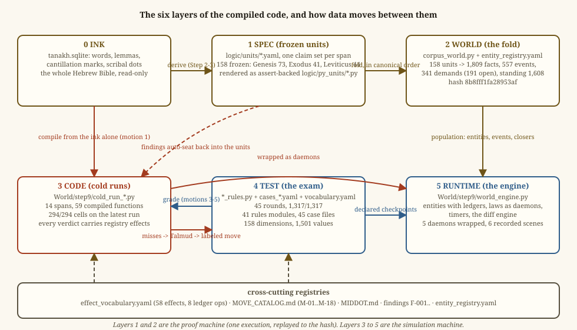

# ARCHITECTURE — the map of the compiled code, Genesis through Leviticus

Written 2026-09-05 from the files as they stood that day (the Emor
sweep, Leviticus 21 to 24, was in flight and uncommitted; the exam stood
at round 45). This folder
describes the code; it is not the code. Nothing in it is canon, and
nothing outside this folder was changed to make it.

**How to read this folder.** Start here for the six layers and how data
moves between them. Then open [FUNCTION_CATALOG.md](FUNCTION_CATALOG.md)
for one card per compiled span, [DEPENDENCIES.md](DEPENDENCIES.md) for
every edge between spans and books, and
[STATE_MACHINES.md](STATE_MACHINES.md) for the five machines that carry
state across time. The pictures live in [diagrams/](diagrams/) and are
drawn by `tools/build_diagrams.py`. The numbers are re-checked by
`tools/collect_facts.py`, which reruns every compiled span read-only and
writes `catalog_facts.json`; if the prose and that file disagree, the
prose is stale.

**The program itself.** This map describes the layers. The code's own
content, what it does from Genesis 1:1 onward, is one page:
[program/LINKED.html](program/LINKED.html). A trial variant,
[program/LINKED_NARRATIVE.html](program/LINKED_NARRATIVE.html), is the
same page with one more layer: click a block's bullet and a short
paragraph opens beneath it, three to five sentences in a fixed shape
(what happens in the text, what the machine does with it, what the
tradition adds with its source named, what carries forward). The
paragraphs live in [NARRATIVE.md](NARRATIVE.md), one heading per block,
editable by hand; `tools/build_linked.py --narrative` rebuilds the page
from it. As of 2026-09-05 the four Bereshit bullets have paragraphs and
the other 74 await the owner's word on the voice. It opens as a block summary,
thirty-three blocks cut at the scroll's weekly-portion breaks, each with
its mode, its operator counts, and two to four plain sentences. Under each
block a link opens its units; under each unit, its verses in plain
English; under each verse, the code as written and the claims checked
there; under each claim, the evidence. Searchable, one self-contained
file, regenerated by `tools/build_linked.py` from the frozen units (163
units through the end of Leviticus on 2026-09-05). The three helper
scripts beside it, `build_summary.py`, `build_plain_outline.py`, and
`build_program_outline.py`, supply its layers; run on their own they
would write separate per-grain files into `program/`, which were removed
on the owner's word so that the linked page stands alone.

## The six layers

| Layer | What it holds | Where it lives | Size on 2026-09-05 |
|---|---|---|---|
| 0 Ink | the text itself: words, lemmas, cantillation marks, the fifteen scribal dots | `elijah_docket/tanakh.sqlite` (whole Bible), `torah_grok.sqlite` (the oral shelf: Babylonian Talmud entire, Mishnah, Tosefta, Jerusalem Talmud tractates, midrash, the rabbinic commentary collections) | 39 books; 668,695 link rows on the shelf |
| 1 Spec | frozen units: one claim set per span, derived from the ink under the book's spine, rendered as assert-backed programs | `logic/units/*.yaml`, `logic/py_units/*.py`, `logic/oral_audit/manifests/` | 309 unit files, 158 frozen (Genesis 73, Exodus 41, Leviticus 44), 160 renderings |
| 2 World | the fold of every frozen unit, in canonical order, into one state: entities, facts, events, demands, standing law, a hash | `corpus_world.py`, `logic/corpus/entity_registry.yaml`, `logic/corpus/CORPUS_TRUTH.py`, `World/` | 158 units, 1,809 facts, 557 events, 341 demands (191 open), 81 names, standing 1,608, hash `8b8fff1fa28953af` |
| 3 Code | cold-compiled functions, one file per law span, compiled from the ink alone, graded against Mishnah rows, every verdict carrying effects | `World/step9/cold_run_*.py` | 14 spans, 59 compiled functions, 294 graded cells, all matching |
| 4 Test | the exam: rules modules organized by Mishnah topic, case files, the vocabulary of dimensions and values the cases speak | `World/step9/*_rules.py`, `cases_*.yaml`, `vocabulary.yaml`, `RULE_CATALOG.md`, `EXAM_LEDGER.md` | 45 rounds, 1,317/1,317; 41 modules, 45 case files, 537 rule ids; 158 dimensions, 1,501 values |
| 5 Runtime | the engine: entities with ledgers, laws as daemons that fire unasked, timers, the diff engine | `World/step9/world_engine.py`, `effects_layer.py` | 5 daemons wrapped, 6 recorded scenes, all checkpoints matching |

Cross-cutting registries tie the layers together and are read by more
than one of them:

- `World/step9/effect_vocabulary.yaml`: 58 registered effects, each with
  a ledger operation. By operation: status 19, timer 10, debit 8,
  transfer 5, body 5, heaven 5, block 4, destroy 2.
- `logic/MOVE_CATALOG.md`: the eighteen teacher moves, M-01 to M-18.
  Every non-ink cell in layer 3 is labeled with one.
- `logic/MIDDOT.md`: the tradition's own inference rules, the thirteen
  for law and the thirty-two for narrative, with their case law.
- The findings, F-001 onward, recorded in `EXAM_LEDGER.md` and seated
  back into layer 1 automatically.
- `logic/corpus/entity_registry.yaml`: who is who across units.

## How data moves

**Ink to Spec (Steps 2 and 3 of THE_STEPS).** A span is read under its
spine (Bereshit Rabbah for Genesis, the Mekhilta for Exodus, the Sifra
for Leviticus, Onkelos everywhere), claims are extracted, the unit is
written, gated, stamped, and frozen. Genesis units carry narrative
claims: who did what, what was promised, what stands open. Exodus and
Leviticus units carry law claims.

**Spec to World (the fold).** `corpus_world.py` folds the frozen units
in canonical order into one world. The hash has not moved since
2026-08-10. Note what the counts say: facts, events, and demands are the
same numbers the Genesis-only world reported. The law units of Exodus
and Leviticus add standing law, 1,608 entries, and no narrative facts.
The world hash tracks the narrative.

**Ink to Code (motion 1 of Step 5).** Each `cold_run_*.py` reads the
bare tokens of its span from the word database, probes every token it
claims before running (the zero-report law), and writes its functions
with every ink-borne cell tagged INK. Quantities the ink does not state
become parameters, never constants.

**Test to Code (motions 2 to 5).** The Mishnah's rows are collected as
test data. The run prints every miss. Each miss sends the compiler to
the Talmud or the Sifra for that exact gap, and the recorded argument is
replayed as a labeled move on the changed line. When the matrix matches,
every cell carries its provenance: INK, a named MOVE, DATA (a
transmitted quantity), FENCE (a rabbinic boundary the answer sheet
labels as such), or IMPORT and ROUTED (a rule reached from another span
or book).

**Code to Spec (the findings loop).** What the compile discovers about
the ink is seated back into the frozen unit as a finding, with the
manifest, rendering, and standing count rebaked. Standing rises by
exactly one per seat; the hash does not move.

**Code and World to Runtime.** A compiled function becomes a daemon:
`law(event, world)` returning effects in the fixed interface
`{effect, subject, counterparty, amount, due, source_law, case_source}`.
The engine fires every daemon on every event, writes effects to entity
ledgers, sets timers for effects owed to the future, and cancels timers
when a later text event voids them. At each checkpoint the diff engine
compares the computed ledger to what the text or the answer sheet
declares.

## The invariants

- **Evidence immutable, models rewritable.** Units, ledgers, and tests
  are evidence. Layers 3 to 5 are models and may be rewritten freely
  while the gates stay green.
- **Code from the ink alone.** No Mishnah or Talmud row is encoded in a
  function. They enter as test data at run time.
- **The fence.** The engine never invents an event. Acts come from the
  text; the law computes only consequences and writes only the ledger.
- **Effects on every verdict.** Every compiled cell either writes a
  registered effect or states an honest no-change.
- **One derivation stream.** One session writes; the state doc records
  every step.
- **Hebrew never without English.** Every Hebrew token in every layer
  carries its gloss.

## What the two machines are

Layers 1 and 2 are the **proof machine**. The text is the program, it
has exactly one execution, and replaying it to the stamped hash is a
proof. It takes no inputs by design.

Layers 3, 4, and 5 are the **simulation machine**. Layer 3 is the
compiled law. Layer 4 grades it. Layer 5 runs it over entities and
time. The population it runs on is layer 2, the entities and events the
narrative supplies, and the closing acts (the ram brought, the iron
recovered) that come from the text and close ledger entries the law
opened.

## What is not here yet

- Genesis has no compiled law functions. It supplies the world (layer 2)
  and twelve exam blocks in layer 4.
- Of the 59 compiled functions, five are wrapped as daemons. The rest
  run only in their cold-run files.
- The narrative event typer, which would turn a narrative passage into an
  engine event by its opener lemma, does not exist. Every engine scene is
  hand-written from a recorded case.
- Leviticus 21, 22, and 25 to 27 are drafts. Leviticus 23 (the appointed
  times engine) and Leviticus 24:10-23 (the first call) are compiled; the
  Emor sweep that freezes their units was in flight when this was written.
