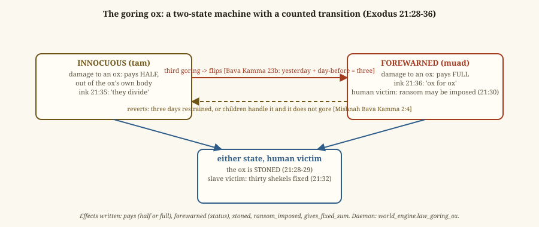
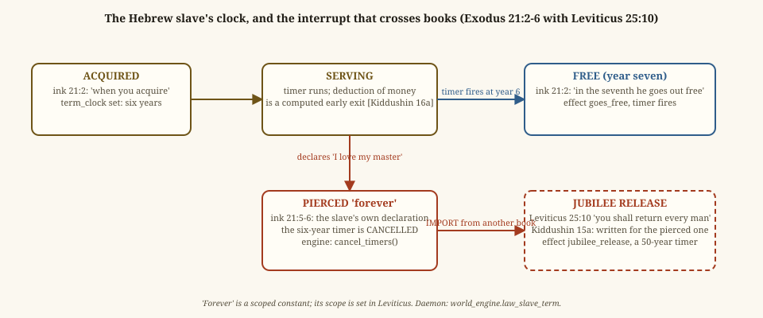
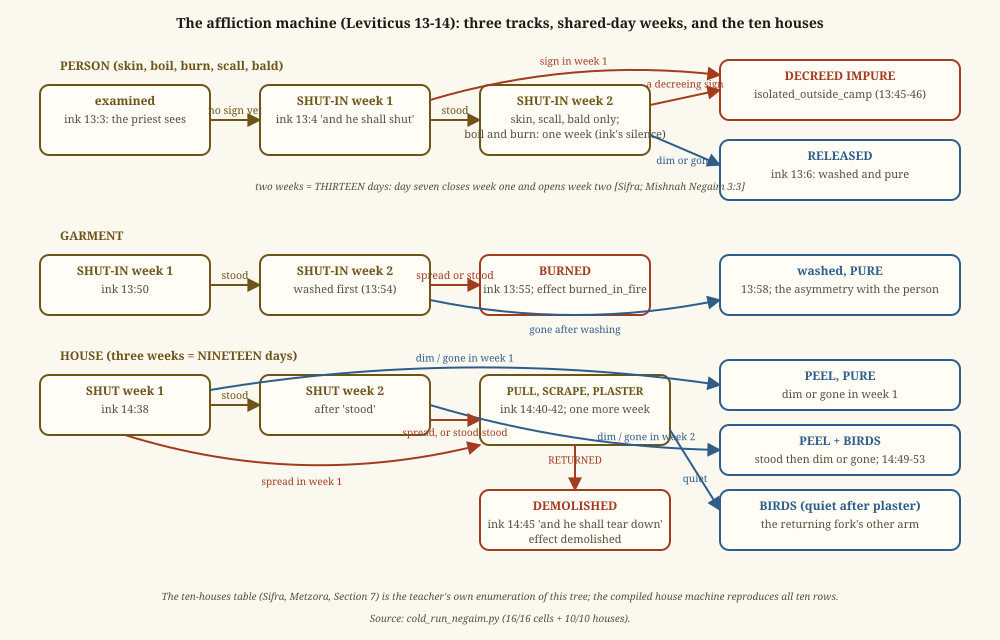
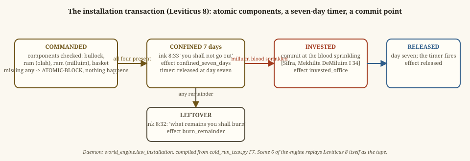
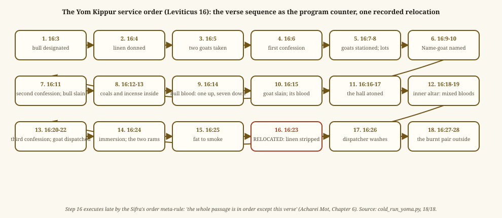

# STATE MACHINES — the compiled laws that carry state across time

Written 2026-09-05 with five machines; the fourth book's seven added
2026-09-13. Most compiled functions are lookups: a case in, a verdict
and its effects out. Twelve carry state that changes with events or
with the clock. Each is drawn once here, with its transitions cited to the ink and to the
recorded argument that fixed any transition the ink leaves open. The
drawings restate the code; they add nothing to it.

## 1. The goring ox (Exodus 21:28-36)

| From | Event | To | Effect | Source |
|---|---|---|---|---|
| innocuous | gores an ox | innocuous | owner pays half, from the ox's own body | ink 21:35 "they shall divide" |
| innocuous | third goring | forewarned | status forewarned | Bava Kamma 23b:17-18: "yesterday and the day before" parsed as three (move M-05) |
| forewarned | gores an ox | forewarned | owner pays full, "ox for ox" | ink 21:36 |
| either | gores a human | stoned | the ox is stoned; if forewarned, ransom may be imposed on the owner | ink 21:28-30 |
| either | gores a slave | as above, plus a fixed thirty shekels | gives_fixed_sum | ink 21:32 |
| forewarned | three days restrained, or children handle it and it does not gore | innocuous | reverts | Mishnah Bava Kamma 2:4 (the answer key's own reverse transition; Rabbi Meir's arm on the children) |

Compiled in `cold_run_mishpatim.py` (6/6). Daemon: `law_goring_ox`, which
keeps the goring count on the ox entity's status and flips it at three.

## 2. The Hebrew slave's clock (Exodus 21:2-6 with Leviticus 25:10)

| From | Event | To | Effect | Source |
|---|---|---|---|---|
| free person | acquired | serving | term_clock (six years); goes_free set as a timer for year seven | ink 21:2 |
| serving | pays the balance | free | a computed early exit | Kiddushin 16a:11, from 21:8 "let her be redeemed" |
| serving | declares "I love my master" and is pierced | pierced, "forever" | the six-year timer is cancelled | ink 21:5-6; engine `cancel_timers()` |
| pierced | the Jubilee is proclaimed | free | jubilee_release | Leviticus 25:10 imported; Kiddushin 15a:19: written even for the pierced one |
| serving | year seven arrives | free | goes_free fires | ink 21:2 |

Compiled in `cold_run_mishpatim.py` (3/3). Daemon: `law_slave_term`. This
is the machine that forced timer cancellation into the engine's
interface: the slave's own recorded declaration had to void his exit.

## 3. The affliction machine (Leviticus 13-14)

Three tracks share one shape: examine, shut in for a week, look again,
decide. They differ in their signs, their weeks, and their end states.

| Track | Signs that decree | Weeks | End states |
|---|---|---|---|
| skin | white hair, raw flesh, spread | 2 | decreed impure (isolated outside the camp), or released (washed and pure) |
| boil, burn | white hair, spread | 1 | the same; the one-week track is the ink's own silence, no second shutting written |
| scall | thin yellow hair, spread | 2 | the same |
| bald | raw flesh, spread | 2 | the same |
| garment | deep green, deep red, spread | 2 | burned in fire, or washed and pure |
| house | deep green, deep red, spread | 3 | peel and pure; peel and birds; birds; demolished |

**The day arithmetic.** Two weeks are thirteen days and three weeks are
nineteen, because the seventh day closes one week and opens the next
(the Sifra's shared-junction rule; Mishnah Negaim 3:3 and 3:8 state the
numbers).

**The ten houses.** The Sifra (Metzora, Section 7) enumerates the house
machine's whole decision tree as ten cases. The compiled machine
reproduces all ten:

| Week 1 | Week 2 | After pull, scrape, plaster | Verdict |
|---|---|---|---|
| dim | | | peel, pure |
| gone | | | peel, pure |
| stood | dim | | peel, birds |
| stood | gone | | peel, birds |
| spread | | returned | demolish |
| spread | | quiet | birds |
| stood | spread | returned | demolish |
| stood | spread | quiet | birds |
| stood | stood | returned | demolish |
| stood | stood | quiet | birds |

Compiled in `cold_run_negaim.py` (16/16 cells, the houses 10/10). Not
yet a daemon. Effects registered from this compile:
isolated_outside_camp, burned_in_fire, demolished.

## 4. The installation transaction (Leviticus 8)

| From | Event | To | Effect | Source |
|---|---|---|---|---|
| commanded | components checked: bullock, ram for the olah, ram for the installation, basket | confined | confined_seven_days; released set as a timer for day seven | ink 8:33; the atomicity from Sifra, Tzav, Mekhilta DeMiluim I 19 |
| commanded | any component missing | nothing | ATOMIC-BLOCK logged, no effect written | the same |
| confined | installation blood sprinkled | invested | invested_office | Mekhilta DeMiluim I 34: consummated only at the sprinkling |
| any | leftover remains | | burn_remainder | ink 8:32 |
| invested | day seven | released | the timer fires | ink 8:33 |

Compiled in `cold_run_tzav.py` as the installation function (part of
33/33). Daemon: `law_installation`. Engine scene 6 replays Leviticus 8's
own narrative as the tape, six checkpoints matching: no basket means no
priesthood; seven days on a timer; invested at the sprinkling; released
at day seven.

## 5. The Yom Kippur service order (Leviticus 16)

Not a state machine with branches but a sequence with one recorded
relocation: the chapter's verse order is the program counter, and the
Sifra's order meta-rule ("the whole passage is said in order except this
verse", Acharei Mot Chapter 6) moves 16:23 late, so the linen is
stripped after the rams and the fat. Eighteen steps, compiled in
`cold_run_yoma.py` (18/18). Beside the sequence sit the atonement
routing table, a knowledge-state dispatch the ink leaves as parameters
and the Sifra fills, and the fellow gate from Mishnah Yoma 8:9: the day
atones between man and God; between man and his fellow only once the
fellow is appeased.

## 6. The tent's docket (Leviticus 24:10-23; Numbers 9:6-14, 15:32-36, 27:1-11 with 36:1-12; the deed at 25:10-13)

*No drawing yet; the pictures are redrawn when the tools are taught the fourth book.*

The one machine that carries state on the law itself. Four times the
story stops because the library cannot answer, and the text says so
in its own words — "to be declared to them," "stand and I will hear,"
"it had not been declared," "Moses brought their judgment near." The
program halts there: the case goes on the court's docket, the person
into whatever the text puts him in, and nothing more is written until
the answer verse arrives. The answer installs a rule — a whole law,
or a cell inside a law that already stood — and the deed closes the
rest. The tradition's own dispute about what the answer is, a rule
for the generations or an edict for the instance, is a setting
(`case_output`); under the running setting the rule is written.

| From | Event | To | Effect | Source |
|---|---|---|---|---|
| a case no rule decides | "they placed him in the guard" | the docket open, the man held | in_custody on the person (a body entry); declaration_owed on the court, carrying which daemons had already written on the case verse | ink Lev 24:12, Num 15:34; Sanhedrin 78b:4-7 (the incarceration derived; the two uncertainties told apart) |
| a case no rule decides | "stand, and I will hear" | the docket open, the men waiting | waits_for_the_word on each person; declaration_owed on the court | ink Num 9:8; Sifrei Bamidbar 68:1 |
| a case no rule decides | "Moses brought their judgment near" | the docket open, nobody held | declaration_owed alone — nothing in the ink holds the persons; the uncertainty the scope, not the liability | ink Num 27:5; Sifrei 133:4; Bava Batra 119a:6; Sanhedrin 8a:4 |
| the docket open | the answer verse, a sentence | the rule installed | rule_installed on the tent, its value the law (or the cell) the answer installs; the docket closed; the instance's verdict written only where no daemon had decided it | ink Lev 24:13-14, Num 15:35; Sifrei 114:1 ("for all the generations" / "in this instance"); Sanhedrin 80b:5 the first tanna |
| the docket open | the answer verse, a statute | the rule installed | rule_installed; the docket closed; each person's wait closed; the case's own due (the second Passover's date, the daughters' holding) where neither the ledger nor a pending timer carries it | ink Num 9:9-14, 27:6-11; Sifrei 69:1 (the rule wider than the question) |
| the rule installed | a second plea on the same case | bounded, no halt | rule_installed a second time, its value the cell (the tribal transfer) — relayed in Moses' mouth, no docket owed | ink Num 36:5-9; Bava Batra 120a:10 |
| the man held | "and he died, as the LORD commanded" | closed | stoned, in_custody and put_to_death closed by the deed | ink Lev 24:23, Num 15:36 |
| no case at all | a zealot's deed, ratified | the rule installed | rule_installed by the deed, no halt and no docket | ink Num 25:10-13; Sanhedrin 82a |

Compiled as the tent daemon in `world_engine.py` (`law_tent`), with the
case-born laws beside it (`cold_run_lev24.py`, `cold_run_pesach_sheni.py`,
`cold_run_mekoshesh.py`, `cold_run_zelophehad.py`, `cold_run_balak.py`).
On the running world the docket holds four cases, all closed, and the
tent carries seven installed rules. The scenario instrument was built
for this machine: the daughters' own argument was put to the live
world at the left edge of 27:5, before 27:6 was on the tape.

## 7. The manslayer's term (Numbers 35:9-34)

*No drawing yet.*

A killing enters a table the text writes as cases — the instrument,
the manner, the intent — and leaves it as one of three verdicts: a
murderer, a manslayer, or neither. The murderer's path ends at once.
The manslayer's opens a term with an end but no length.

| From | Event | To | Effect | Source |
|---|---|---|---|---|
| a killing | iron; or a stone or wood "of the hand whereby he may die"; in enmity, in hatred, lying in wait | a murderer | put_to_death (the sword, from the neck); no ransom; two witnesses | ink 35:16-21, 30-31; Mishnah Sanhedrin 9:1-2; Sanhedrin 76b:12-13; Ketubot 37b |
| a killing | suddenly, without enmity, without lying in wait, without seeing, not his enemy; a downward motion | a manslayer | flees_to_refuge | ink 35:22-23; Mishnah Makkot 2:1; Makkot 7b:2-6 |
| a killing | the marks read neither way | neither | exempt — neither death nor exile, the row marked unresolved | Sifrei 160:8; Makkot 7b:4 |
| a manslayer | the congregation judges — the court of twenty-three | delivered and returned | dwells_in_refuge, a body entry, open, its value the name of the high priest in office | ink 35:24-25; Mishnah Sanhedrin 1:6; Sifrei 160:8; Makkot 10b:14 |
| dwelling in refuge | goes out beyond the border | outside | has_blood = no blood on him — the avenger who kills him is clear; the burglar's own status reused | ink 35:26-27; Exodus 22:1; Makkot 12a:8-15 |
| dwelling in refuge | "the high priest died" — the priest whose name the entry carries | home | the entry closed by value; returns_to_his_possession | ink 35:25, 28; Mishnah Makkot 2:6; Makkot 11a:12 (three high priests from the three seats) |
| dwelling in refuge | another high priest died | dwelling still | nothing — only the name on the entry closes it | Mishnah Makkot 2:6 (sentenced under one, returns at that one's death) |
| any | a ransom offered | unchanged | refused — for the murderer's life and for the manslayer's exile alike | ink 35:31-32; Ketubot 37b:3-4 |

Compiled in `cold_run_refuge.py` (51/51). Daemon: `law_refuge`, which
on "the high priest died" closes every open term carrying that
priest's name. No timer is set anywhere in this machine: the text
gives no day. On the running world no one flees in the Torah's own
story, so no term stands; the test world runs the tradition's cases —
three terms, two under Eleazar and one under Phinehas, closed by the
two deaths in the Mishnah's order. Eleazar's death is Joshua 24:33,
outside the Torah: the term's closer by design.

## 8. The vow's hearing day (Numbers 30)

*No drawing yet.*

A debt toward Heaven, opened by the vower's own mouth, with a clock
that belongs to someone else: her father's, or her husband's, hearing
day. Which authority may act depends on her status, and the wrong one
writes nothing.

| From | Event | To | Effect | Source |
|---|---|---|---|---|
| no vow | a vow uttered | bound | vow_bound, a debit toward Heaven, its value the vow; a minor's, or a vow against an owed duty — exempt, no vow | ink 30:3-4; Sifrei 153:3; Mishnah Niddah 5:6 (the ages); Mishnah Nedarim 11:4 |
| bound | the authority hears | the day running | vow_confirmed set as a timer, due at the hearing day's end (the calendar row: to nightfall; the twenty-four-hour reading the row's other arm, never run); "you did well" confirms at once; the deaf hear nothing; a vow he thought another's starts no clock | ink 30:5, 8, 15; Sifrei 153:5, 156:1; Nedarim 76b, 77b:5, 73a:4; Mishnah Nedarim 11:5 |
| the day running | restrained by the right authority that day | annulled | the timer cancelled, the debit closed, vow_annulled — Heaven's entry, "and the LORD will forgive her" | ink 30:6, 9, 13; Sifrei 153:6 |
| the day running | restrained by the wrong authority; in part; through a messenger; a married woman's vow neither of affliction nor between them | the day running | nothing — the vow stands | Mishnah Nedarim 10:1 (the betrothed: both together); 11:1-2 (the affliction vows); Nedarim 72b, 87a (R. Yishmael); R. Yoshiyah on the steward |
| the day running | the day ends in silence | confirmed | the timer fires: vow_confirmed — confirmed for one hour, never annulled | ink 30:5, 15; Sifrei 153:5; Nedarim 79a:1 |
| confirmed | the husband annuls after the day | confirmed still | iniquity_borne on the husband, Heaven's entry; the woman clear | ink 30:16; Sifrei 156:2 |
| confirmed | the father annuls after the day | confirmed still | nothing — the ink names the husband alone | ink 30:16 |

The authorities, by her status: a man, none; a daughter in her youth
in her father's house, her father; the betrothed maiden, her father
and her husband together; the married woman, her husband; the widow
and the divorcee, none — "her vow shall stand against her."

Compiled in `cold_run_vows.py` (147/147). Daemon: `law_vows`, whose
machine runs on the engine's own timers: in the test world eight are
set, five fire and three are cancelled, every number predicted by
script before the run. Two questions the Talmud leaves standing — a
divorce after the hearing, and annulment without hearing — are rows
marked unresolved, and the machine keeps the ink's own trigger.

## 9. The corpse-uncleanness clock, and the second Passover it causes (Numbers 19:11-22; 9:6-14)

*No drawing yet.*

The longest personal clock in the fourth book and the case it
produced. Touching the dead makes a person unclean seven days, with
two sprinklings fixed on the third and the seventh; and men unclean by
a corpse at the Passover became the tent's second case.

| From | Event | To | Effect | Source |
|---|---|---|---|---|
| clean | touches a corpse; enters a tent with one | unclean seven days | corpse_unclean_seven_days; sprinkling_due_third_day and sprinkling_due_seventh_day as timers at the day plus three and plus seven | ink 19:11-14, 19; the row third_day_fixed; Kiddushin 62a; Mishnah Oholot 3:6-7 |
| unclean | sprinkled on both days, then washed and bathed, at the evening | clean | declared_pure | ink 19:12, 19 |
| unclean | either sprinkling missed | unclean still | not_purified — the interval is fixed; the third and the eighth are invalid | ink 19:12-13; Kiddushin 62a:4-7; Shabbat 16b:3 |
| unclean | touches another | the other unclean until evening | impure_until_evening — the second grade; vessels three in a series, persons two | ink 19:22; Mishnah Oholot 1:1-4 |
| unclean | enters the sanctuary, unpurified | cut off | karet_cut_off and lashes; unwitting, the sliding-scale offering by the awareness grid | ink 19:13, 20; Makkot 14b; Mishnah Shevuot 1:1-2:5 |
| unclean at the first Passover, or on a distant way | the case brought | the tent's docket (machine 6) | second_passover_due, a debit toward Heaven with a due the calendar computes: the fourteenth of the second month | ink 9:6-11; Sifrei 69:1 (all who could not keep the first keep the second); Mishnah Pesachim 9:1 |
| clean and near, refrained | the first Passover passes | cut off | karet_cut_off; the karet table for the first and the second missed together — deliberate on both all agree, unwitting on both all agree, the mixed cases the row's arms | ink 9:13; Pesachim 93b:7-9 |

Compiled in `cold_run_chukat.py` (159/159) and `cold_run_pesach_sheni.py`.
Daemons: `law_chukat` and `law_pesach_sheni`. On the running world
the war with Midian set six of these timers on the men of war and the
captives, all pending at the tape's end; and the unclean men's second
Passover, set at their case's day, fired on the walk to the next
stated date — by the calendar's arithmetic, not by construction. The
Levites' cleansing in chapter 8 and the camp's purity in chapter 5
reach this machine by call.

## 10. The nazirite's term (Numbers 6:1-21)

*No drawing yet.*

The book's other personal clock, and the one whose timer is cancelled
and re-set by the text's own rule.

| From | Event | To | Effect | Source |
|---|---|---|---|---|
| free | vows a nazirite's vow | separated | nazirite_vow_bound; nazirite_term_fulfilled as a timer at the day plus the term — thirty days unspecified, "two terms" for "and a day," forever with a shave each thirty | ink 6:2-8; Mishnah Nazir 1:3-6; the row nazir_default_days |
| separated | a corpse dies beside him suddenly | defiled | the timer cancelled — "the former days shall fall"; the seventh day he shaves, the eighth he brings two birds and a lamb; the term re-set from the eighth day | ink 6:9-12; Mishnah Nazir 6:6; Nazir 18a-b (the recount from the eighth); the row nazir_recount_day |
| separated | wine, the razor, the dead | the count voided or lashes, by the row | count_voided, or the offense's own effect; a barley-grain bone defiles by touch and carrying, not by tent | ink 6:3-7; Mishnah Nazir 6:1-5, 7:2 |
| separated | the days fulfilled | released | the timer fires; the shaving at the tent's door, the four offerings, the cooked shoulder waved to the priest — released; "afterward the nazirite may drink wine" | ink 6:13-20; Sifrei 37:1; Mishnah Nazir 6:7-11 |

Compiled in `cold_run_naso.py` (274/274, the nazirite among nine
cells). Daemon: `law_naso`. The vow's age rule is shared with machine
8 by call — the vows' program reads the nazirite's "clearly utter" for
the examined year.

## 11. The altar's calendar (Numbers 28-29)

*No drawing yet.*

Story 8 of THE_EFFECTS.md gave the daily lamb a recurring debt with a
period of one day. This machine adds eight recurring debts whose
periods are words the calendar knows.

| From | Event | To | Effect | Source |
|---|---|---|---|---|
| the altar, the daily lamb's debt open since Exodus 40 | the calendar commanded | eight timers armed | musaf_owed on the altar, one per key — the Sabbath, the month, the first day of Passover, the day of firstfruits, the first of the seventh month, the tenth, the first of Sukkot, the eighth — each due at the calendar's next such day, its value the day's table of bulls, rams, lambs and goats; the daily debt read, not written again | ink 28:2, 10, 14; 29:39; Mishnah Menachot 4:4 (the daily and the additional do not hold each other up) |
| a timer armed | its day arrives | the day's debt open, the timer re-armed | musaf_owed fires; the timer asks the calendar for the next such day | ink 28:10 "on its Sabbath," 28:14 "in its month" |
| the day's debt open | the offering brought | closed | the close by the act — no offering line stands on the tape in the fourth book | Mishnah Zevachim 10:1 (the frequent precedes) |
| the seven days of Sukkot | the day's number | the watches' shares | a function of the declining table: sixteen offerings to sixteen watches on the first day, then fifteen; the seventh every watch one; the eighth's bull by lot or to a twice-watch (a recorded dispute) | ink 29:13-34; Mishnah Sukkah 5:6; Sukkah 55b |

Compiled in `cold_run_musafim.py` (110/110). Daemon: `law_musafim`,
installed when the LORD called from the tent, the appointed-times
law's own form. The dates come by call from the Leviticus 23 program
and match the calendar's own arithmetic asked the other way; the
master row of tenths and hins is the libation table of Numbers 15 by
call. The first period timers ever set on the tape.

## 12. The stipulation of Gad and Reuben (Numbers 32)

*No drawing yet.*

A conditional grant, the tradition's own textbook case for the law of
every condition, held open across the Jordan.

| From | Event | To | Effect | Source |
|---|---|---|---|---|
| the tribes' request | "let this land be given to your servants for a holding" | a plea on the compound party | plea_made | ink 32:5 |
| the plea | Moses' rebuke; the tribes' offer | unchanged | nothing written — the oath retold is read against chapter 14's ledger; the offer is bound at the condition's line | ink 32:6-19 |
| the plea | the condition stipulated, doubled | two debits on the compound party | commanded: cross armed before the LORD until the land is subdued (open by design to Joshua 22:1-9); commanded: build cities for the little ones and folds (closed at 32:34-38) | ink 32:20-24; Mishnah Kiddushin 3:4; Gittin 75a:11-14 (the four limbs of every condition) |
| the condition | the commission charged | a debit on the dividers | commanded on the dividers of the land: give them Gilead if they cross | ink 32:28-30 |
| the condition | the acceptance, twice | unchanged | nothing written — the seal on the parties' side; the utterance rule binds them at 32:24 by call into the vows | ink 32:25-27, 31-32; 30:3 |
| the condition | the grant | given from now | holding_given, three transfers from Israel's possession by conquest, valued at the two and a half tribes' count read off the population table; the debit open beside them — "on condition" is "from now" | ink 32:33; Gittin 75b:2 (Rav Huna in Rav's name) |
| the grant | the cities built | the build debit closed | cities_built on Gad and on Reuben | ink 32:34-38 |
| the grant | the negative arm | recorded, never run | "you have sinned against the LORD" and "they shall take possessions among you in the land of Canaan" — the arm's outcome a row with the Talmud's two positions | ink 32:23, 30; Kiddushin 61b:2-8 |

Compiled in `cold_run_gad_reuben.py` (74/74). Daemon: `law_gad_reuben`,
a stipulation in Moses' voice with no divine frame — its class named in
the registry, the second pass to decide. The crossing debit and the
commission's charge stand open at the Torah's end, in the class
Caleb's Hebron and the captives' sentence share: the release is a
later book's.

## Machines not drawn

- **The four guardians** is a pure table, four roles by three events; it
  is drawn in the tutorial page and carried in the engine as a matrix.
- **The offering dispatcher** is a lookup over eight offering classes and
  six columns; its grid is the answer sheet itself, Mishnah Zevachim 5.
- **The Passover engine** carries three timers (the purge deadline, the
  eating window, the leftover's burning) and ten access blocks, but no
  state that transitions on later events.
- **The festival calendar** carries the first timer on a land entity, the
  seventh year, and the recurring weekly rest; these are clocks, not
  machines with branches.
- **The appointed times engine** (Leviticus 23) adds two more clocks,
  the omer count and the seven days in booths, and one status, taking the
  four species; again clocks, not branching machines.
- **The dedication's schedule** (Numbers 7) is twelve dues written into
  a past the clock has already walked — one command, twelve retro-writes
  checked against the text's own day-heads; no branch.
- **The decree's forty years** (Numbers 14) is one timer set in the
  second year and fired in the fortieth, with the population table's
  membership check at the second census (no man of the first roll save
  two); a clock and a predicate, not a machine.
- **The heifer's rite** (Numbers 19:1-10) is a sequence like the Yom
  Kippur service: the slaughter outside, the sprinkling toward the tent
  seven times, the burning whole with the cedar, the hyssop and the
  scarlet, the ashes kept; its consumer is machine 9.
- **The suspected wife** (Numbers 5) is a procedure with one clock left
  as a parameter — merit suspends the waters for three, nine or twelve
  months, or not at all, by named authorities.
- **Miriam's seven days** (Numbers 12) run on the leper's confinement
  week by call into the affliction machine; the halt of the camp is a
  debit the text closes when she is brought in.
- **The refuge cities' court** (Numbers 35:24) is a count, not a
  machine: twenty-three built from the congregation-tokens, the size a
  data row.
